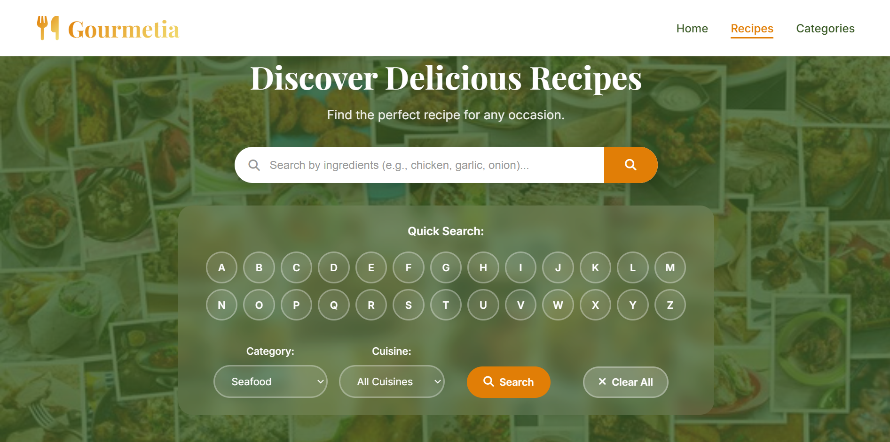

# 🍳 Gourmetia - Recipe Search Application


A modern, responsive recipe search application built with vanilla JavaScript, HTML5, and CSS3. Discover delicious recipes from around the world with our powerful search engine.


## 📸 Screenshot




## 🌟 Features

### 🔍 **Advanced Search Capabilities**
- **Ingredient-based search**: Find recipes by specific ingredients
- **Category filtering**: Browse by recipe categories (Beef, Chicken, Dessert, etc.)
- **Cuisine filtering**: Search by regional cuisines
- **Alphabetical search**: Quick search by recipe name starting letter
- **Combined filters**: Use multiple search criteria simultaneously

### 📱 **Responsive Design**


### 🎨 **Modern UI/UX**


### 📄 **Recipe Details**
- **Comprehensive information**: Ingredients, instructions, cooking time, servings
- **Step-by-step instructions**: Numbered cooking steps for easy following
- **Ingredient lists**: Detailed measurements and preparation notes
- **Recipe images**: High-quality food photography


## 🚀 Live Demo

**🌐 [View Live Demo](https://recipe-app-kappa-six-89.vercel.app/)**

*Experience the full functionality of Gourmetia with our live demo!*

## 🛠️ Technologies Used

- **Frontend**: HTML5, CSS3, Vanilla JavaScript (ES6+)
- **APIs**: TheMealDB API 
- **Icons**: Font Awesome 6.4.0
- **Fonts**: Google Fonts (Playfair Display, Inter)
- **Design**: Custom CSS with modern design principles


## 🚀 Installation & Setup
### Direct File Opening
1. **Clone or download** the project files
2. **Open** `index.html` in your web browser
3. **Start using** the application immediately

```bash
php -S localhost:8000
```


## 🎯 How to Use

### 1. **Search by Ingredients**
- Type ingredients in the search bar (e.g., "chicken, garlic, onion")
- Click the search button or press Enter
- Browse through matching recipes

### 2. **Filter by Category**
- Select a category from the dropdown menu
- Click the "Search" button
- View recipes in that category

### 3. **Filter by Cuisine**
- Choose a cuisine type from the dropdown
- Click "Search" to find regional recipes

### 4. **Quick Alphabetical Search**
- Click any letter button (A-Z)
- Instantly see recipes starting with that letter

### 5. **Browse Popular Categories**
- Scroll to the "Popular Categories" section
- Click on any category card
- Explore featured recipes

### 6. **View Recipe Details**
- Click on any recipe card
- View detailed ingredients and step-by-step instructions
- See cooking time, servings, and other details


**Made with ❤️ by [Constanza Ramos]**

